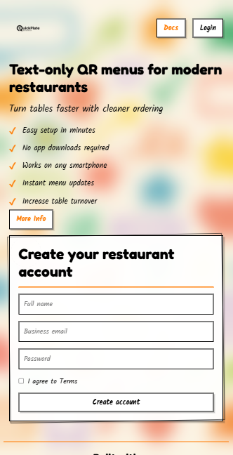
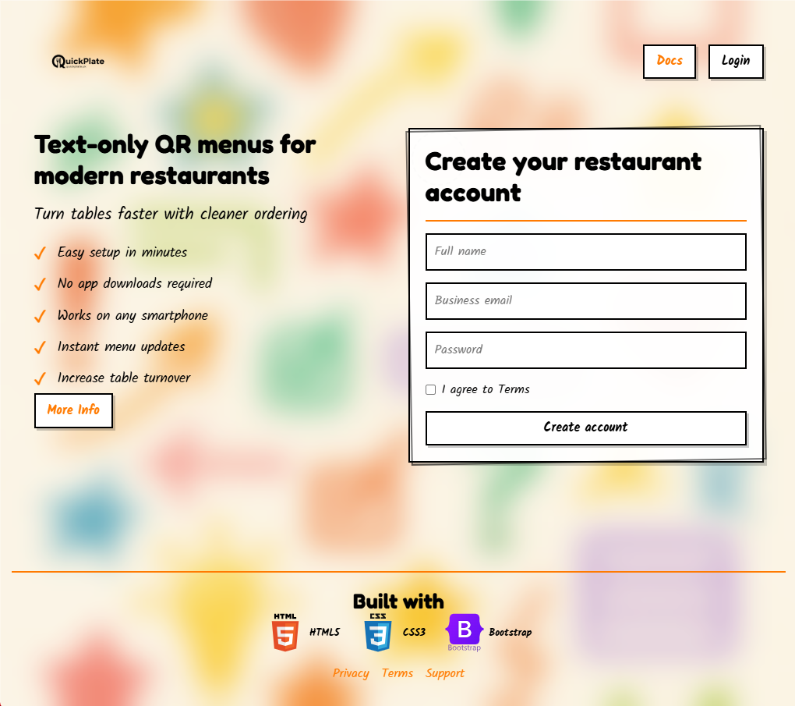
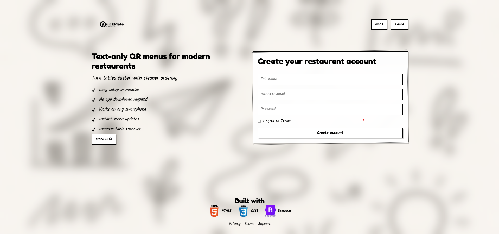
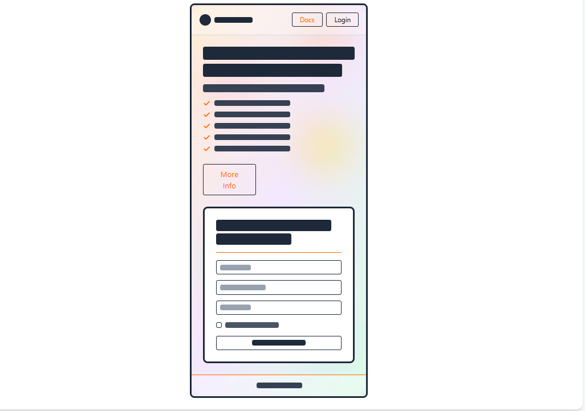
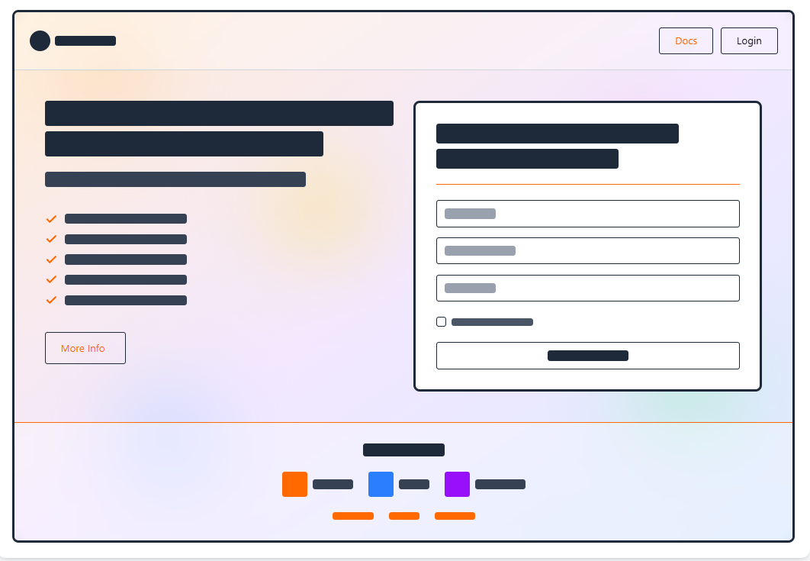

📖 About The Project
https://quickplate.app
Quickplate is a concept landing page for a QR-menu SaaS.
This build focuses on:

A mobile-first workflow
Sketch-style UI using CSS pseudo-elements
A responsive layout using both Bootstrap and custom CSS
Glassmorphism overlays
Background images that change per device size
Clean CSS variables + design system setup

This project allowed me to refine responsive design and deepen my understanding of CSS effects that look hand-drawn but remain fully scalable.

📱 Mobile-First Design

Quickplate was designed starting from mobile.
Every layout decision begins with phones, then scales up to tablets, laptops and desktops.

This approach gives the UI:

✓ cleaner spacing
✓ better readability
✓ predictable breakpoints
✓ faster loading
✓ consistency across all screen sizes

Mobile Layout Screenshot

🧩 Responsive Layout (Scaling Up)

After building the mobile version, I progressively enhanced for larger screens.

📱 Tablet View (768–1023px)

•Increased white-space
•Larger logo
•More balanced layout

💻 Laptop View (1024–1439px)

•Switches to the sketch-style black & white background
•Headings scale up
•Wider grid layout

🖥 Desktop View (1440px+)

•Full-width layout
•Maximum spacing
•Cleanest presentation

🎨 Design Details

✏️ Custom Sketch Border Effect

One of the signatures of this UI is the hand-drawn border used on the form container.
This is created with a CSS ::before pseudo-element placed slightly offset, rotated, and lowered in opacity to imitate a real pencil sketch.

Screenshot

🌫 Glassmorphism Layer

The page uses a glass-like overlay to soften backgrounds:

Blur filters

Transparent white wash

Inset highlights

Stacked z-index layers

This allows bright gradient or doodle backgrounds without affecting readability.

⚙️ Key Features

✓ Mobile-first responsive layout
✓ Dynamic background images based on screen width
✓ Sketch-style border effect using CSS ::before
✓ CSS variables for colour and spacing consistency
✓ Bootstrap grid system for structure
✓ Fade-in animation for feature list
✓ Clean form design with subtle interaction states
✓ Fully semantic HTML

🛠 Built With

HTML5 — structure

CSS3 — custom sketch UI, animations, glassmorphism

Bootstrap 5 — grid + responsive utilities

Google Fonts — “Kalam” + “Fredoka”

Devicon — tech stack icons

📁 Project Structure

Quickplate-html-css-bootstrap/
│
├── index.html
├── docs.html
├── README.md
│
└── assets/
    ├── css/
    │   └── styles.css
    │
    └── images/
        ├── Logo.png
        └── Screenshots/
            ├── preview.png
            ├── mobile-first.png
            ├── tablet-view.png
            ├── laptop-view.png
            ├── desktop-view.png
            ├── sketch-border-closeup.png
            ├── glass-layer.png

⚙️ Installation

# Clone repository
git clone https://github.com/SadikMohamud/Quickplate-html-css-bootstrap.git

# Navigate into project
cd Quickplate-html-css-bootstrap

# Open in browser
open index.html

🚀 Deployment

Already deployed using GitHub Pages
and connected to a custom Namecheap domain.

🔮 Future Improvements

Add full SaaS onboarding

Add dark mode

Add animated SVG doodles

Convert to React + Tailwind version

Add multi-page dashboard mockups

🤖 AI Tools Used

This project was enhanced using:

DeepSeek — primary assistant for code planning & structuring

GitHub Copilot — inline code suggestions

ChatGPT — layout refactoring, responsive design help, documentation

Claude — early wireframe guidance

-----wireframes-----
Desktop & Laptop

Mobile-wireframe

tablet wireframe

All tools used for learning and speeding up workflow.

---

👤 Author

Sadik Mohamud
Code Institute Student
GitHub: @SadikMohamud

Built with ❤️ as a learning project to deepen my understanding of responsive design, CSS effects, and visual design systems.
