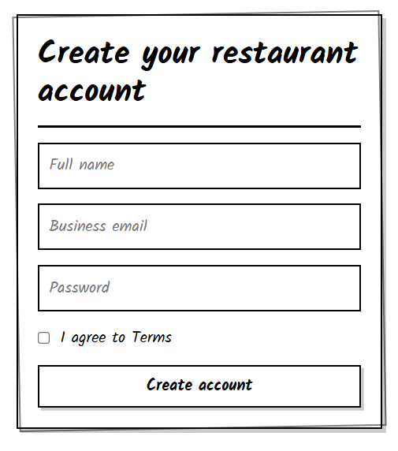
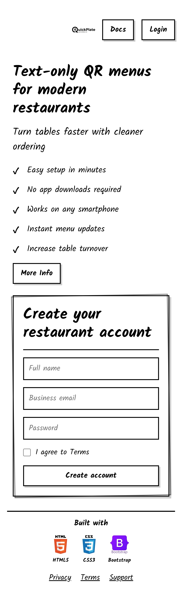
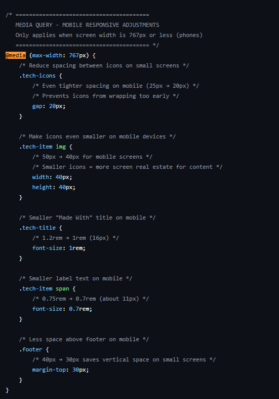
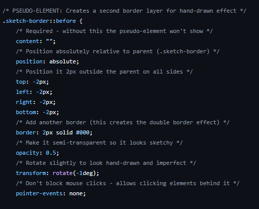

# Quickplate
https://sadikmohamud.github.io/Quickplate-html-css-bootstrap/index.html

A QR menu service landing page with a hand-drawn aesthetic. This project recreates a prototype I built previously, now using Bootstrap for the first time.


## About This Project

This is a learning project for Code Institute where I explored Bootstrap framework. The design features a sketch-style interface that makes it feel handcrafted and approachable for restaurant owners.

## What I Built

- Responsive landing page with sign-up form
- Documentation page with service information
- Hand-drawn design using CSS pseudo-elements
- Mobile-friendly layout with Bootstrap grid

### Sign-Up Form


The form features a custom sketch border effect created with CSS pseudo-elements.

### Mobile Responsive


Fully responsive design that adapts to all screen sizes.



## Technologies Used


- **HTML5** - Page structure
- **CSS3** - Custom styling and effects
- **Bootstrap 5** - Responsive grid system (first time using it!)
- **Google Fonts** - Kalam handwritten font

## Design Details

### Custom Border Effect


The signature hand-drawn border uses CSS `::before` pseudo-elements with rotation to create an imperfect, sketchy look.

## Key Features

✓ Sketch-style borders using CSS `::before` pseudo-elements  
✓ Custom CSS variables for consistent design  
✓ Responsive layout that works on all devices  
✓ Interactive button hover effects  
✓ Clean, semantic HTML5 structure  

## What I Learned

This project helped me understand:
- Bootstrap's grid system and utility classes
- CSS pseudo-elements for creating visual effects
- Building responsive layouts without writing media queries from scratch
- Organizing CSS with custom properties
- Creating consistent design systems with CSS variables

## Installation

```bash
# Clone the repository
git clone https://github.com/SadikMohamud/Quickplate-html-css-bootstrap.git

# Navigate to project directory
cd Quickplate-html-css-bootstrap

# Open in browser
open index.htmlProject Structure
Quickplate-html-css-bootstrap/
│
├── index.html              # Main landing page
├── docs.html               # Documentation page
├── README.md               # This file
│
└── assets/
    ├── css/
    │   └── styles.css      # Custom styles
    │
    └── images/
        ├── Logo.png        # Site logo
        └── Screenshots/    # README screenshots
            ├── laptop.png
            ├── sign_up_form.png
            ├── mobile_first_design.jpg
            ├── mobile_responsiveness.png
            ├── CSS_fonts_import.png
            └── pseudo_elements_double_sketch_border.png


Live Demo
🔗 View Live Site
Browser Support
✅ Chrome (latest)
✅ Firefox (latest)
✅ Safari (latest)
✅ Edge (latest)
✅ Mobile browsers
Credits
Bootstrap - Framework
Google Fonts - Kalam typeface
Devicon - Tech stack icons in footer
AI Assistance & Tools Used
This project was developed with assistance from AI tools:
DeepSeek - Primary AI assistant for code development and problem-solving
GitHub Copilot - Code suggestions and autocompletion in VS Code
ChatGPT - Additional guidance and troubleshooting support
Special thanks to these tools for helping me learn Bootstrap and CSS techniques throughout this project.
Author
Sadik Mohamud
Code Institute Student
GitHub: @SadikMohamud
Built with ❤️ as a learning project for Code Institute
